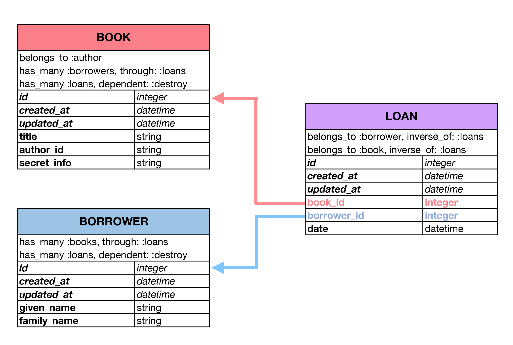

[](https://generalassemb.ly/education/web-development-immersive)

# Rails API Many-To-Many

This lesson assumes you have forked and cloned the following:

-   [rails-api-library-demo](https://git.generalassemb.ly/ga-wdi-boston/rails-api-library-demo)
-   [rails-api-clinic-code-along](https://git.generalassemb.ly/ga-wdi-boston/rails-api-clinic-code-along)
-   [rails-api-cookbook-lab](https://git.generalassemb.ly/ga-wdi-boston/rails-api-cookbook-lab)

1.  Open a desktop view for each of these projects
1.  Open an Atom, Terminal, and browser window for each project

## Prerequisites

-   [rails-api-single-resource](https://git.generalassemb.ly/ga-wdi-boston/rails-api-single-resources)
-   [rails-api-one-to-many](https://git.generalassemb.ly/ga-wdi-boston/rails-api-one-to-many)

## Objectives

By the end of this, developers should be able to:

-   Create a many-to-many relationship with existing models.
-   Create and utilize a join table.
-   Create a new resource using `scaffold`.
-   Specify an `inverse_of` relationship.
-   Compare and contrast objects created in the join table versus those that were not.

## Preparation

1.  Fork and clone this repository.
 [FAQ](https://git.generalassemb.ly/ga-wdi-boston/meta/wiki/ForkAndClone)
1.  Create a new branch, `training`, for your work.
1.  Checkout to the `training` branch.

## Where We Left Off

Previously we created a single model, `Book`.

Then we created a second model `Author` and linked it to `Book`.

Now we are going to add a third model: `Borrower`, then we are going to create
a fourth model, `Loan`, which is going to act as a link between the
`Borrower`s and `Book`s.

This `Loan` model will connect `Borrower` and `Book` together. Earlier, when we
were working with a `one-to-many` relationship `books` belonged to an `author`.
When we created a migration:

```ruby
class AddAuthorToBooks < ActiveRecord::Migration
  def change
    add_reference :books, :author, index: true, foreign_key: true
  end
end
```

...we added an `author` reference column to the `books` table which is able to
store a reference to an author of a particular book.

With `Borrowers`, we know this is a two way street however: `Books` can have
many `Borrowers` and `Borrowers` can have many `Books`. In order to make this
a two way street we are going to need a `join table`.

## Join Tables

A `join table` is a special model which holds references to two or more models.

Let's see what this association might look like:



<!-- Image from Rails Docs -->

In the above example, the `loans` model is the `join table`. You can see
it has both a `book_id` attribute and a `borrower_id` attribute.  Both of these
attributes store references to their respective models.

You can also see an attribute called `date`. You are allowed to add
other attributes on to your `join table`, but you do not necessarily have to.  In this
case it makes sense, in some cases it may not, use your judgement.

## Create Additional Resources

### Demo: Create Borrower Resource

Let's make a borrower resource with scaffolding:

`bin/rails generate scaffold borrower given_name:string family_name:string`

Let's check to see if our scaffolded code is correct.

Now let's migrate that in so we don't confuse ourselves if we have to
rollback:

`bin/rails db:migrate`

## Renaming Associations

### Code Along: Renaming Clinic Associations

We want to create a new association between `doctor` and `patient`.

However, there are a few things to consider:
- Patients view doctors through specific professions.
- Doctors view patients differently as well.
- Relationships in a model **cannot** have the same name.

With this in mind, we can think of...: a doctor can have many *types* of patients and a patient can have different *types* of doctors. *Think: primary care recipient and primary care physician.*

In order to keep the work we've done so far, we'll want to modify our model associations to keep the relationship intact.

But where do we start? [The Rails Guide](http://guides.rubyonrails.org/association_basics.html) has all the answers.

Looks like we need to add a `class_name` attribute to both models and a `foreign_key` attribute to the `patient` model.


```ruby
class Patient < ApplicationRecord
  ## This is the standard use case
  belongs_to :doctor

  ## This is exactly the same as the above
  ## but shows what rails assumes
  belongs_to :doctor, class_name: 'Doctor',
                      foreign_key: 'doctor_id',
                      inverse_of: 'patients'
  # patient1.doctor will return us an instance of Doctor if there is one for that patient

  ## If we want our association name to be 'primary_care_physician'
  belongs_to :primary_care_physician
  ## then rails will make the wrong assumptions
  belongs_to :primary_care_physician,
                    class_name: 'PrimaryCarePhysician',
                    foreign_key: 'primary_care_physician_id',
                    inverse_of: 'patients'
  ## THESE ARE ALL WRONG ^^^ Why? Do we have a PrimaryCarePhysician class?
                              ##  What do we want doctorWho.patients to return?

  ## So we have to tell it explicitly
  ## which class and foreign key our association name should point to
  belongs_to :primary_care_physician,
                     class_name: 'Doctor',
                     foreign_key: 'doctor_id',
                     inverse_of: 'primary_care_recipients'
  # patient1.primary_care_physician will return us an instance of a Doctor
end
```

In `models/patient.rb`:

```ruby
class Patient < ApplicationRecord
  belongs_to :primary_care_physician,
             class_name: 'Doctor',
             foreign_key: 'doctor_id',
             inverse_of: 'primary_care_recipients'

  validates :name, presence: true
  validates :born_on, presence: true
end
```

In `models/doctor.rb`:

```ruby
class Doctor < ApplicationRecord
  has_many :primary_care_recipients,
           class_name: 'Patient',
           inverse_of: 'primary_care_physician'

  validates :given_name, presence: true
  validates :family_name, presence: true
end
```

### Lab: Renaming Cookbook Associations

Now rename the associations for the `recipe` and `ingredient` models.

## Making a Join Table

### Demo: Create Loan Model

We're going to use the generators that Rails provides to generate a `loan` model
along with a `loan` migration that includes references to both `borrower` and
`book`.

```ruby
bin/rails generate scaffold loan borrower:references book:references date:datetime
```

Along with creating a `loan` model, controller, routes, and serializer, Rails
will create this migration:

```ruby
class CreateLoans < ActiveRecord::Migration
  def change
    create_table :loans do |t|
      t.references :borrower, index: true, foreign_key: true
      t.references :book, index: true, foreign_key: true
      t.datetime :date

      t.timestamps null: false
    end
  end
end
```

So our `Loan` model now has the following attributes: id, borrower_id, book_id, and date.

Let's run our migration with `bin/rails db:migrate`

The following command let's us take a peek at our database and see how this model looks:

```bash
bin/rails db
```

Once we have our prompt, `rails-api-library-demo_development=#`, we'll type:

```bash
\d loans
```

Now we see all the columns contained in the `loans` table.

### Code Along: Create Appointment Model

We're going to use the generators that Rails provides to generate an `appointment`
model along with an `appointment` migration that includes references to both
`patient` and `doctor`.

```ruby
bin/rails generate scaffold appointment doctor:references patient:references date:datetime
```

Along with creating an `appointment` model, controller, routes, and serializer,
Rails will create this migration:

```ruby
class CreateAppointments < ActiveRecord::Migration
  def change
    create_table :appointments do |t|
      t.references :doctor, index: true, foreign_key: true
      t.references :patient, index: true, foreign_key: true
      t.datetime :date

      t.timestamps null: false
    end
  end
end
```

So our `appointment` model now has the following attributes: id, doctor_id,
patient_id, and date.

Let's run our migration with `bin/rails db:migrate`

Let's take a peek at our database and see how this model looks. Simply type:

```bash
bin/rails db
```

If your prompt looks like this `rails-api-clinic-code-along_development=#` type:

```bash
\d appointments
```

You will be able to see all the columns contained in the `appointments` table.


### Lab: Create Recipe Ingredient Model

Create a join table, `recipe_ingredients`, that represents the association between the `recipe` and `ingredient` models.

**Note:** Naming things is hard and if you absolutely can't come up with a good associative name, then mash the two model names together.

## Through: Associated Records

### Demo: Modifying Library Associations

While we can see that in the `loan` model some some code was added for us:

```ruby
class Loan < ActiveRecord::Base
  belongs_to :borrower
  belongs_to :book
end
```

But we need to go into our models (`borrower`, `book`, and `loan`) and add some
more code to finish creating our associations.

Let's go ahead and add that code starting with the `book` model:

```ruby
# Book Model
class Book < ActiveRecord::Base
  belongs_to :author
  has_many :borrowers, through: :loans
  has_many :loans
end
```

In our borrower model we will do something similar:

```ruby
# Borrower Model
class Borrower < ActiveRecord::Base
  has_many :books, through: :loans
  has_many :loans
end
```

Finally in our `loan` model we're going to update it to:

```ruby
class Loan < ActiveRecord::Base
  belongs_to :borrower
  belongs_to :book
end
```

### Code Along: Modifying Clinic Associations

While we can see that in the `appointment` model some some code was added for us:

```ruby
class Appointment < ActiveRecord::Base
  belongs_to :doctor
  belongs_to :patient
end
```

But we need to go into our models (`patient`, `doctor`, and `appointment`) and
add some more code to finish creating our associations.

Let's go ahead and add that code starting with the `patient` model:

```ruby
# Patient Model
class Patient < ActiveRecord::Base
  has_many :doctors, through: :appointments
  has_many :appointments
end
```

In our doctor model we will do something similar:

```ruby
# Doctor Model
class Doctor < ActiveRecord::Base
  has_many :patients, through: :appointments
  has_many :appointments
end
```

Finally in our `appointment` model we're going to update it to:

```ruby
class Appointment < ActiveRecord::Base
  belongs_to :doctor, inverse_of: :appointments
  belongs_to :patient, inverse_of: :appointments
end
```

What is `inverse_of` and why do we need it? Recall the example we discussed
with `author` and `book`.

### Lab: Modifying Cookbook Associations

Go ahead and set up the three models with the appropriate associations.

## Updating Serializers

### Demo: Modifying Library Serializers

Now that we can see some data it's time to update our serializers or these
relationships will not be as useful as they can.

Let's add the `borrowers` attribute to our attributes list in our `book` serializer.

Our finished serializer should look like this:

```ruby
class BookSerializer < ActiveModel::Serializer
  attributes :id, :title, :borrowers
end
```

Let's do the same in our `borrower` serializer, it should look like this once,
we're done.

```ruby
class BorrowerSerializer < ActiveModel::Serializer
  attributes :id, :family_name, :given_name, :books
end
```

### Code Along: Modifying Clinic Serializers

Now that we can see some data it's time to update our serializers or these
relationships will not be as useful as they can.

Let's add the `patients` attribute to our attributes list in our `doctor` serializer.

Our finished serializer should look like this:

```ruby
class DoctorSerializer < ActiveModel::Serializer
  attributes :id, :given_name, :family_name, :patients
end
```

Let's do the same in our `patient` serializer, it should look like this once,
we're done.

```ruby
class PatientSerializer < ActiveModel::Serializer
  attributes :id, :family_name, :given_name, :doctors
end
```

### Lab: Modifying Cookbook Serializers

Your turn! Add the appropriate attribute to the 'recipe' and 'ingredient' serializers.

## Test Using Curl

### Demo: Testing Loans Table

Now, let's test this using curl. To connect `books` and `borrowers` we are going
to post to the join table:

```bash
curl --include --request POST http://localhost:4741/loans \
  --header "Content-Type: application/json" \
  --data '{
    "loan": {
      "borrower_id": "2",
      "book_id": "2",
      "date": "2016-11-22T11:32:00"
    }
  }'
```

Using this curl request as our basis, we will `Create`, `Read` and `Update` the loans
table.

The same result could be achieved in the Rails console using Ruby. How might
we write that command?

### Code Along: Testing Appointments Table

Now, let's test this using curl. To connect `doctors` and `patients` we are going
to post to the join table:

```bash
curl --include --request POST http://localhost:4741/appointments \
  --header "Content-Type: application/json" \
  --data '{
    "appointment": {
      "doctor_id": "2",
      "patient_id": "2"
    }
  }'
```

Using this curl request as our basis, we will `Create`, `Read` and `Update` the appointments
table. *DO NOT DELETE*

### Lab: Testing Recipe Ingredients Table

Now it's your turn to test the `recipe_ingredients` join table. Use the above curl scripts as examples to achieve your task.

## Dependent Destroy

### Demo: Add Library Dependent Destroy

Say we wanted to delete a book or an borrower. If we delete one we proably want to
delete the association with the other.  Rails helps us with this with a method
called `dependent destroy`.  Let's edit our `book` and `borrower` model to inclde it
so when we delete one, reference to the other gets deleted as well.

Let's update our models to look like the following:

```ruby
# Book Model
class Book < ActiveRecord::Base
  belongs_to :author
  has_many :borrowers, through: :loans
  has_many :loans, dependent: :destroy
end
```

```ruby
class Borrower < ActiveRecord::Base
  has_many :books, through: :loans
  has_many :loans, dependent: :destroy
end
```

Let's test this out by using curl request to construct relationships then remove them.

```bash
curl --include --request DELETE http://localhost:4741/borrowers/2
```

How could we write the same command in the Rails console using Ruby?

### Code Along: Add Clinic Dependent Destroy

Say we wanted to delete a patient or an doctor. If we delete one we proably want to
delete the association with the other.  We'll use the `dependent destroy` to help us achieve this goal. Let's edit our `patient` and `doctor` model to inclde it
so when we delete one, reference to the other gets deleted as well.

Let's update our models to look like the following:

```ruby
# Doctor Model
class Doctor < ActiveRecord::Base
  has_many :patients, through: :appointments
  has_many :appointments, dependent: :destroy
end
```

```ruby
class Patient < ActiveRecord::Base
  has_many :doctors, through: :appointments
  has_many :appointments, dependent: :destroy
end
```

Let's test this out by using curl request to construct relationships then remove them.

### Lab: Add Cookbook Dependent Destroy

Go ahead and setup the dependent destroy method on the `recipe` and `ingredient` models.

Don't forget to test with curl requests!

## [License](LICENSE)

1.  All content is licensed under a CC­BY­NC­SA 4.0 license.
1.  All software code is licensed under GNU GPLv3. For commercial use or
    alternative licensing, please contact legal@ga.co.
